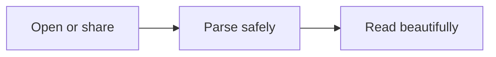

# A better place to read Markdown

Open a local file, drop one here, paste Markdown, or **share a file from another Android app** after installing MD Viewer. Your document stays on this device.

> **Note**
> This sample shows the formats the viewer understands. Use **Open file** when you're ready.

## Rich Markdown

| Format | Example | Supported |
|:--|:--|:--:|
| GFM tables | Alignment and overflow | ✓ |
| Task lists | `- [x] Complete` | ✓ |
| Footnotes | References[^one] | ✓ |
| Code | Highlighted fences | ✓ |

- [x] GitHub-flavored Markdown
- [x] CommonMark, autolinks, and ~~strikethrough~~
- [x] Sanitized inline HTML

## Equations

Inline math works with dollars, such as $e^{i\pi}+1=0$, or LaTeX brackets: \((a+b)^2\).

Display math accepts both common styles:

$$
\int_{-\infty}^{\infty} e^{-x^2}\,dx = \sqrt{\pi}
$$

\[
\mathbf{A}\mathbf{x}=\mathbf{b}
\]

## Code and diagrams

```ts
const readable = (markdown: string) => render(markdown);
```



[^one]: Footnotes are collected automatically at the end of the document.
